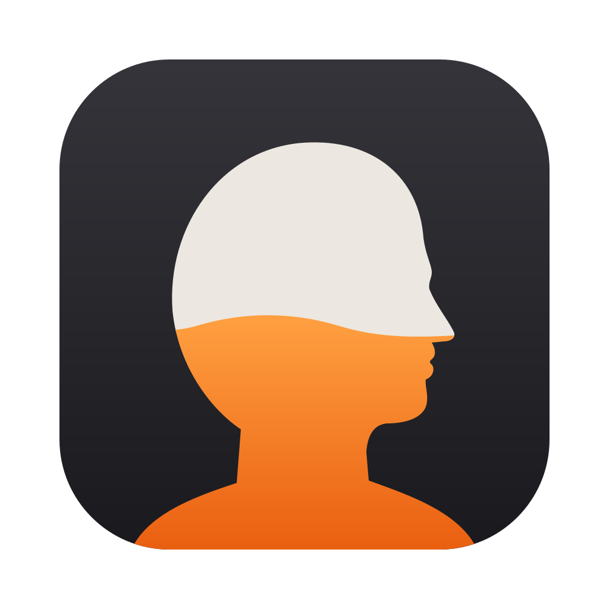

# Headroom

A macOS menu bar app that shows how much of your Claude plan's limits you've used, for
every Claude Code account on your Mac at once.

- **5-hour and weekly limits** per account, with reset countdowns. The menu bar shows one
  column per account: its label beside two small bars with percentages, 5-hour on top and
  weekly below.
- **Open Claude Code sessions** per account, with model and context used. Sessions that
  haven't replied for 15 minutes are marked idle.
- **Today's API-equivalent cost** per account, as estimated by Claude Code. It is not what
  your subscription bills.
- **Optional Live usage** per account, which also catches use from claude.ai, the desktop
  app and other devices.

## Requirements

- macOS 14 (Sonoma) or later.
- [Claude Code](https://code.claude.com) installed and logged in on the Mac with a Claude
  subscription (Pro, Max or Team). Headroom reads usage through Claude Code, so if you only
  use claude.ai or the desktop app, it has nothing to show.

## Install

```sh
curl -fsSL https://raw.githubusercontent.com/DanPurdy/headroom/main/scripts/install.sh | bash
```

That downloads the latest release into `/Applications` (or `~/Applications`) and opens it.

Or download `Headroom-x.y.z.zip` from [Releases](https://github.com/DanPurdy/headroom/releases)
and move `Headroom.app` to Applications. Releases aren't signed with an Apple Developer ID
yet, so macOS blocks a browser download the first time you open it. Either approve it in
System Settings → Privacy & Security → Open Anyway, or run
`xattr -dr com.apple.quarantine /Applications/Headroom.app`.

## Set up

1. Click the gauge in the menu bar, then the **gear** to open Settings.
2. Headroom lists `~/.claude` and every `~/.claude-*` folder. Each Claude Code folder (the
   one `CLAUDE_CONFIG_DIR` points at, or `~/.claude` by default) is one account. If yours
   lives somewhere else, use **Add folder…**.
3. Give each a label and press **Install**. Press Return in the label field to rename it
   later.
4. Send a message in Claude Code on that account. Its usage appears straight away.
5. Optionally switch on **Live usage** for an account (see below) and **Launch at login**.

**Install** edits the `statusLine` setting in that folder's `settings.json` so Headroom sees
each reply. Your existing status line keeps working exactly as before. A copy of the
original `settings.json` is kept in `~/Library/Application Support/Headroom/installs`, and
**Remove** puts the original setting back.

## How it works

Claude Code passes your plan usage (`rate_limits`) to its
[status line command](https://code.claude.com/docs/en/statusline) after every reply.
Headroom wraps that command: it saves the figures to small JSON files in
`~/Library/Application Support/Headroom`, then runs your original status line with the same
input. The status line runs locally and uses no tokens. Without Live, Headroom never touches
your login or calls any API.

Those figures are as of the session's last reply, which for an idle session can be days
old. Headroom dates each reading by the last reply in the session's transcript, and never
lets an older reading replace a newer one.

The app does nothing until something changes. It watches its data files and open Claude
Code processes with kqueue, and otherwise wakes only at moments it has worked out in
advance: a limit window resetting, a reading going stale, midnight, or a Live check falling
due. The only regular tick is the countdown display, once a minute, while the menu is open.

**Without Live**, an account updates only when Claude Code replies on it. Usage from
claude.ai, the desktop app or other devices counts towards the same limits, but shows up
only after that account's next Claude Code reply. Readings older than 30 minutes are dimmed
with an orange "as of" age so you can tell.

### Live usage (optional, per account)

Live also checks an account's usage once an hour and whenever you press ⟳ on its card, so
it catches use from anywhere: claude.ai, the desktop app, mobile and other machines.

- It reads the login Claude Code saved in your Keychain, but only when you switch Live on or
  press ⟳, never in the background. macOS may ask first; choose **Always Allow**. Because
  releases aren't signed with a Developer ID yet, macOS will probably ask again after each
  update.
- The login is kept in memory, not on disk, and the hourly checks reuse it. When it expires,
  or after Headroom restarts, Live pauses until you press ⟳.
- It sends that login to `https://api.anthropic.com/api/oauth/usage`, the undocumented
  endpoint behind Claude Code's `/usage`. Being undocumented, it could change without notice.
- Headroom only reads the login. It never refreshes or replaces it, so it can't log Claude
  Code out. If the saved login has expired, Live says so until Claude Code next runs on that
  account and you press ⟳.
- If Anthropic rate-limits the check, Headroom waits at least 5 minutes before trying again.

## Command line

The app bundle includes the `headroom` command that Claude Code runs:

```sh
H=/Applications/Headroom.app/Contents/MacOS/headroom
$H install --config-dir ~/.claude-work --label Work
$H status
$H uninstall --config-dir ~/.claude-work
```

## Uninstall

1. In Settings, press **Remove** on each account (or run `headroom uninstall` for each
   folder). This puts your original status line back.
2. Quit Headroom and delete it from Applications.
3. Optionally remove its data:
   `rm -rf ~/Library/Application\ Support/Headroom && defaults delete io.github.danpurdy.headroom`.

If you delete the app without step 1, Claude Code's status line stops working until you
remove the `statusLine` entry from that folder's `settings.json`, or restore the backup.

## Troubleshooting

- **An account says "Waiting for the first Claude Code reply".** Send a message in Claude
  Code on that account.
- **My status line disappeared.** The app was moved or deleted. Open Headroom once from its
  new location and it repoints your status lines; otherwise see Uninstall.
- **Live says it couldn't find Claude Code's saved login.** Log in to Claude Code for that
  folder, e.g. `CLAUDE_CONFIG_DIR=~/.claude-work claude`, then `/login`. Headroom finds the
  saved login using naming that Claude Code doesn't document, so please open an issue if it
  still fails.
- **"Move Headroom to your Applications folder".** macOS runs a downloaded app from a
  temporary copy until it has been moved, and Headroom won't point your status line at
  that copy. Move it to Applications and open it again.
- **"…settings.json is shared with …".** Two Claude Code folders use the same
  `settings.json` (usually a symlink from a dotfiles repo), so Headroom can't tell their
  usage apart. Give each folder its own `settings.json`.
- **Numbers differ from claude.ai by a point.** Claude Code and claude.ai round differently.

## Develop

Requires macOS 14+ and Swift 6 (Xcode, or just the Command Line Tools).

```sh
scripts/test.sh          # tests (works with only the Command Line Tools)
swift run HeadroomApp    # run the menu bar app from source
scripts/build-app.sh     # dist/Headroom.app and zip (UNIVERSAL=1 for arm64+x86_64; needs Xcode)
scripts/make-icon.sh     # regenerate the icons after editing assets/icon.svg (needs librsvg)
```

- `Sources/HeadroomCore`: everything testable, including status line parsing, snapshots and
  merging, the settings installer and Live response parsing.
- `Sources/headroom`: the command Claude Code runs as its status line.
- `Sources/HeadroomApp`: the SwiftUI menu bar app.

Both executables ship inside `Headroom.app/Contents/MacOS`. CI runs the tests and a
universal build on every pull request.

### Releasing

Go to Actions → **Release** → Run workflow on `main` and enter a version such as `0.2.0`.
Pushing a `v0.2.0` tag does the same. The workflow tests, builds a universal app, creates the
tag and attaches `Headroom-0.2.0.zip` to a GitHub release, which the install script then
picks up.

Builds are ad-hoc signed. Add the secrets listed in `.github/workflows/release.yml` to get a
Developer ID-signed, notarised build that opens without any Gatekeeper prompt.

## Roadmap: Codex

Codex CLI records the same kind of data in its session logs. In
`$CODEX_HOME/sessions/YYYY/MM/DD/rollout-*.jsonl`, `event_msg` lines with
`payload.type == "token_count"` carry:

```json
"rate_limits": {
  "primary":   {"used_percent": 1.0, "window_minutes": 300,   "resets_at": 1770213616},
  "secondary": {"used_percent": 3.0, "window_minutes": 10080, "resets_at": 1770765266}
}
```

`rate_limits` can be `null`. Watching that folder and reading the newest file's last
non-null `rate_limits` would give a Codex card with no login or tokens involved.
